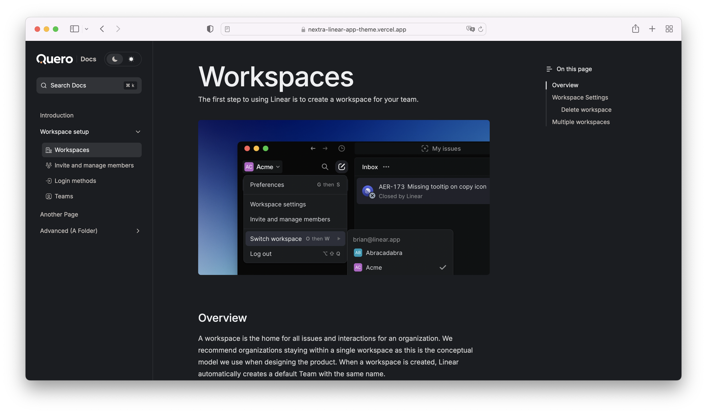
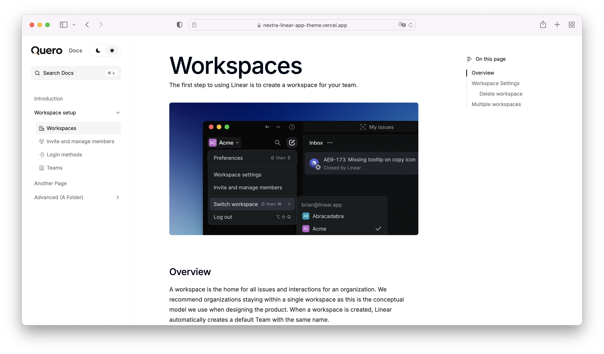
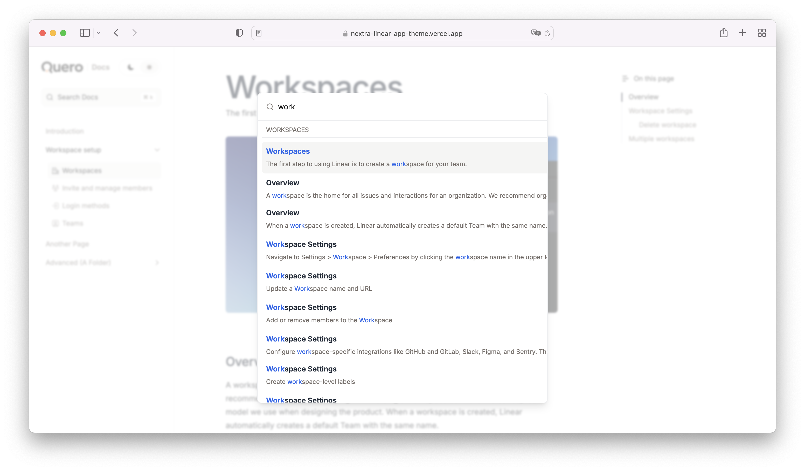

# Nextra Linear App Docs Template

This is a template for creating documentation with [Nextra](https://nextra.site).

[**Live Demo →**](https://nextra-linear-app-theme.vercel.app/)

## Screenshots

### Dark mode

### Light mode

### Search

## Local Development

First, run `pnpm i` to install the dependencies.

Then, run `pnpm dev` to start the development server and visit localhost:3000.

## License

This project is licensed under the MIT License.
